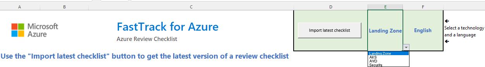
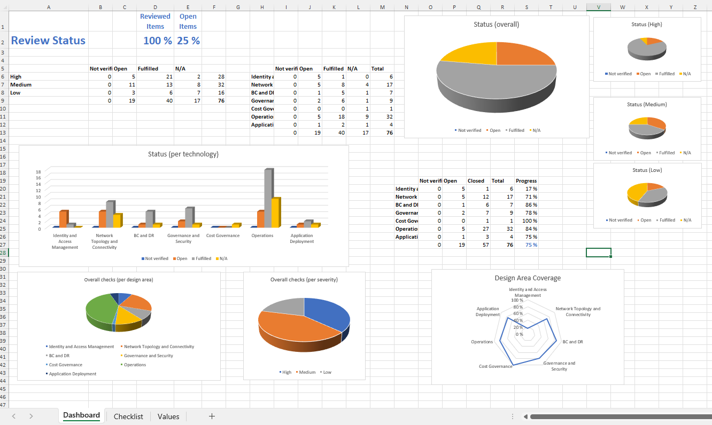

# Azure Review Checklists

When doing Azure design reviews (or any review for that matter), Excel spreadsheets are often the medium of choice. A problem with spreadsheets is that they are not easily made subject to revision control. Additionally, team collaboration with branching, issues, pull requests, reviews and others is difficult at best, impossible in most cases.

This repo separates the actual review checklist content from the presentation layer, so that the JSON-formated checklist that can be subect to version control, and it can then be imported into an Excel spreadsheet by means of Visual Basic for Applications (VBA) macros for easier handling (not all of us like working natively with JSON). The provided [Checklist Review Spreadsheet](./spreadsheet/review_checklist.xlsm) leverages code to interpret JSON from the VBA module in [https://github.com/VBA-tools/VBA-JSON/](https://github.com/VBA-tools/VBA-JSON/), from which there is a copy in this repo to be self-contained (make sure you use the latest version though). The [Checklist Review Spreadsheet](./spreadsheet/review_checklist.xlsm) includes some macros (find the source code both in the spreadsheet as well as [here](./code/Sheet1.cls)), which are accessible from control buttons in the main sheet.

Note: the VBA code in the spreadsheet does not work on Excel for Mac, due to some critical missing libraries.

Additionally, a Github action in this repository translates after every commit the English version of the checklist to additional languages (Japanese, Korean, Spanish and Brazilian Portuguese), using the cognitive service [Azure Translator](https://azure.microsoft.com/services/cognitive-services/translator/). See an example of a translated checklist in [aks_checklist.ja.json](./checklists/aks_checklist.ja.json)

## Using the spreadsheet for Azure reviews

1. Download the Excel spreadsheet from the [latest release](https://github.com/Azure/review-checklists/releases/latest/download/review_checklist.xlsm) to your PC
2. Use the dropdown lists to select the technology and language you would like to do your review

3. Click the control button "Import latest checklist". After you accept the verification message, the spreadsheet will load the latest version of the selected technology and language

4. Go row by row, and set the "Status" field to one of the available options, and write any remarks in the "Comments" field (such as why a recommendation is not relevant, or who will fix the open item)

   1. Since there are many rows in a review, it is recommended procededing in chunks: either going area after area (first "Networking", then "Security", etc) or starting with the "High" priority elements and afterwards moving down to "Medium" and "Low"
   1. If any recommendation is not clear, there is a "More Info" link with more context information.
   1. **IMPORTANT**: design decisions are not a checkbox exercise, but a series of compromises. It is OK deviating from certain recommendations, if the implications are clear (for example, sacrificing security with operational simplicity or lower cost for non-critical applications)

5. Check the "Dashboard" worksheet for a graphical representation of the review progress

## Using the spreadsheet to generate JSON checklist files

If you wish to do contributions to the checklists, one option is the following:

1. Load up the latest version of the checklist you want to modify
2. Do the required modifications to the checklist items
3. Push the button "Export checklist to JSON" in the **"Advanced"** section of controls in the checklist. Store your file in your local file system, and upload it to the [checklists foleder](./checklists) of this Github repo (use the format `<technology>_checklist.en.json`, for example, `lz_checklist.en.json`)
4. This will create a PR, and will be reviewed by the corresponding aprovers.

## Using Azure Resource Graph to verify Azure environments

As you can see for example in [aks_checklist.en.json](./checklists/aks_checklist.en.json), some of the checks have associated two [Azure Resource Graph](https://docs.microsoft.com/azure/governance/resource-graph/overview) queries: one for Azure resources satisfying the condition ("success"), and another one for Azure resources that do not satisfy the condition ("failure").

Accompanying the spreadsheet this repo includes the script [checklist_graph.sh](./scripts/checklist_graph.sh). This script will run the graph queries stored in the JSON checklists and produce an output that can easily be copied and pasted into the spreadsheet, or alternatively generate a JSON file that can then be imported to the spreadsheet.

See the [checklist_graph.sh README file](./scripts/README.md) for more information about how to use [checklist_graph.sh](./scripts/checklist_graph.sh).

## Reporting errors and contributing

Please feel free to open an issue or create a PR if you find any error or missing information in the checklists, following the [Contributing guidelines](./CONTRIBUTING.md)