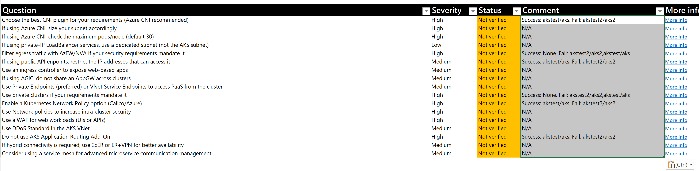

[](https://github.com/marketplace/actions/super-linter)

# Azure Review Checklists

When doing Azure design reviews (or any review for that matter), Excel spreadsheets are often the medium of choice. A problem with spreadsheets is that they are not easily made subject to revision control. Additionally, team collaboration with branching, issues, pull requests, reviews and others is difficult at best, impossible in most cases.

This repo will showcase the idea of having a JSON version of the checklist that can be imported into an Excel spreadsheet by means of Visual Basic for Applications (VBA) macros. The JSON can be subject to version control, and modified as technology or standards evolve.

The provided [Checklist Review Spreadsheet](./spreadsheet/review_checklist.xlsm) leverages code to interpret JSON from the VBA module in [https://github.com/VBA-tools/VBA-JSON/](https://github.com/VBA-tools/VBA-JSON/), from which I put a copy in this repo to be self-contained (make sure you use the latest version though).

Additionally, a Github action in this repository translates after every commit the English version of the checklist to additional languages (Japanese in the first release), using the cognitive service [Azure Translator](https://azure.microsoft.com/services/cognitive-services/translator/). See an example of a translated checklist in [aks_checklist.ja.json](./checklists/aks_checklist.ja.json)

The [Checklist Review Spreadsheet](./spreadsheet/review_checklist.xlsm) includes some macros (find the source code both in the spreadsheet as well as [here](./code/Sheet1.cls)), which are accessible from buttons in the main sheet:


- **"Easy"** section (circled in red in the snapshot above): most frequently used, to import the latest set of checks from a git repo (whose URL is hard-coded in the spreadsheet). The user can select the checklist (today Landing Zone and AKS review checklists are supported) as well as the language
- **"Advanced"** section (circlued in blue in the snapshot above): it allows exporting/importing to specific files, that the user needs to provide:
    - `Import latest reference`:  `Export checklist to JSON`: it will export the checks as a JSON file (you can find two examples in [lz_checklist.en.json](./checklists/lz_checklist.en.json) and [aks_checklist.en.json](./checklists/aks_checklist.en.json))
    - `Import checklist from JSON`: it will import a JSON checklist stored in the local file system

Now you can source-control the JSON file with the checklist items. Changes to the JSON file with the check content can be tracked with issues and PRs, and the checklist set can be then imported in any tool, such as the [Checklist Review Spreadsheet](./spreadsheet/review_checklist.xlsm).

Another potential benefit of separating the delivery tool from the actual content is the same engine (in this example the same spreadsheet) can be used for different checklists. In this repo you find two checklists as example that can be loaded in the [Checklist Review Spreadsheet](./spreadsheet/review_checklist.xlsm):

- Generic Azure Landing Zones (LZ) reviews: [./checklists/lz_checklist.en.json](./checklists/lz_checklist.en.json)
- Azure Kubernetes Service (AKS) Design Reviews: [./checklists/aks_checklist.en.json](./checklists/aks_checklist.en.json)
- Azure Virtual Desktop (AVD) Design Reviews: [./checklists/avd_checklist.en.json](./checklists/avd_checklist.en.json)

## Using Azure Resource Graph to verify Azure environments

As you can see for example in [aks_checklist.en.json](./checklists/aks_checklist.en.json), some of the checks have associated two [Azure Resource Graph](https://docs.microsoft.com/azure/governance/resource-graph/overview) queries: one for Azure resources satisfying the condition ("success"), and another one for Azure resources that do not satisfy the condition ("failure").

Accompanying the spreadsheet this repo includes the script [checklist_graph.sh](./scripts/checklist_graph.sh). This script will run the graph queries stored in the JSON checklists and produce an output that can easily be copied and pasted into the spreadsheet.

For example, to use the script in Azure Cloud Shell:

1. Open an Azure cloud **Bash** shell, for example at [https://shell.azure.com](http://shell.azure.com)
1. Download the `checklist_graph.sh` script with:

```
wget –quiet –output-document ./checklist_graph.sh https://raw.githubusercontent.com/Azure/review-checklists/main/scripts/checklist_graph.sh
```

2. Make sure that the script has execute permissions with:

```
chmod +x ./checklist_graph.sh
```

3. Run the script first to only show the categories of a checklist. For example, for AKS with:

```
./checklist_graph.sh --list-categories --technology=aks
```

4. You should get an output similar to this:

```
0: - Identity and Access Management
1: - Network Topology and Connectivity
2: - BC and DR
3: - Governance and Security
4: - Cost Governance
5: - Operations
6: - Application Deployment
```

5. As you can see in the previous output, the network category was listed as option 1. Now let the script run the Azure Resource Graph queries. For example, to run the graph queries of the network category of the AKS checklist:

```
./checklist_graph.sh --technology=aks --category=1
```

6. You should get an output similar to the following. This example has been run with two AKS clusters in the subscriptions configured in different ways, so that the test results are different:

```
Azure CLI extension resource-graph found with version 2.1.0, trying to upgrade...
Azure CLI extension resource-graph installed with version 2.1.0
INFO: Checking graph queries for category Network Topology and Connectivity...
Success: akstest/aks. Fail: akstest2/aks2
N/A
N/A
N/A
Success: None. Fail: akstest2/aks2,akstest/aks
Success: akstest/aks. Fail: akstest2/aks2
N/A
N/A
N/A
Success: None. Fail: akstest2/aks2,akstest/aks
Success: akstest/aks. Fail: akstest2/aks2
N/A
N/A
N/A
Success: akstest/aks. Fail: akstest2/aks2
N/A
N/A
```

The script will try to install or update the Azure CLI extension `resource-graph`. You can see in the previous output that for certain checks there are no graph queries documented (`N/A`). For the ones with queries, the AKS clusters that pass the check are shown under `Success`. The AKS clusters that do not pass the check are shown under `Failure`. The clusters are displayed with the syntax `resourceGroup/name`.

7. You can now copy the previous output, and past the contents in the comments field of the spreadsheet, so that you don't have to fill in every cell manually. The following image shows the spreadsheet (filtered for the Network category) after pasting the results of the Azure Resource Graph checks in the Comment column:



8. It is also possible running all the Azure Resource Graph queries at once instead on for each category, just by omitting the category selection option:

```
./checklist_graph.sh --technology=aks --category=1
```

9. Alternatively, if you are running the script but not planning to copy and paste the output anywhere, you might want to show the check texts and omit the ones for which there are no Graph queries stored:

```
./checklist_graph.sh --technology=aks --show-text --no-empty
```
