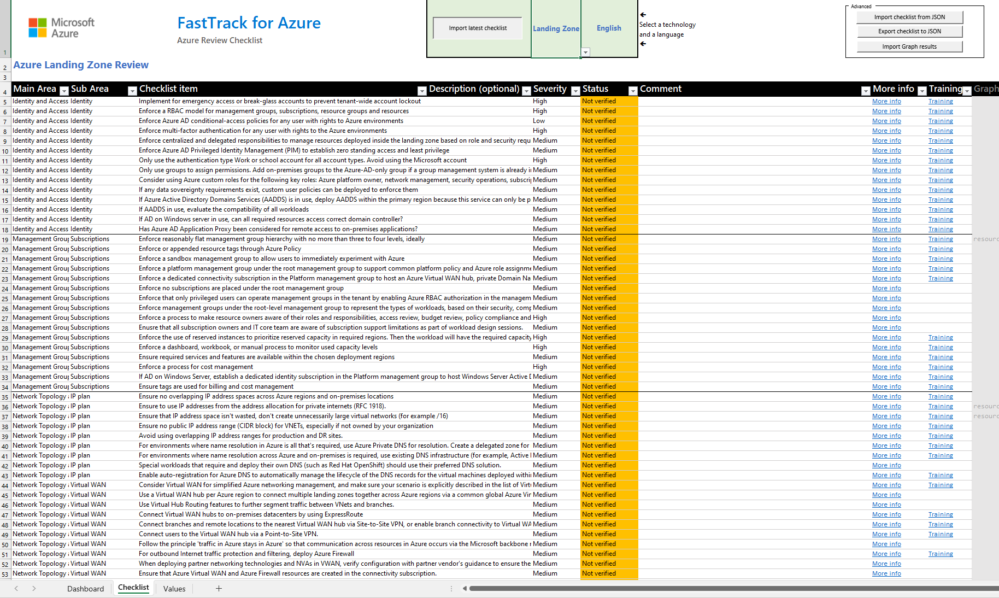
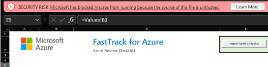
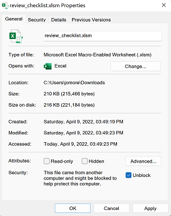
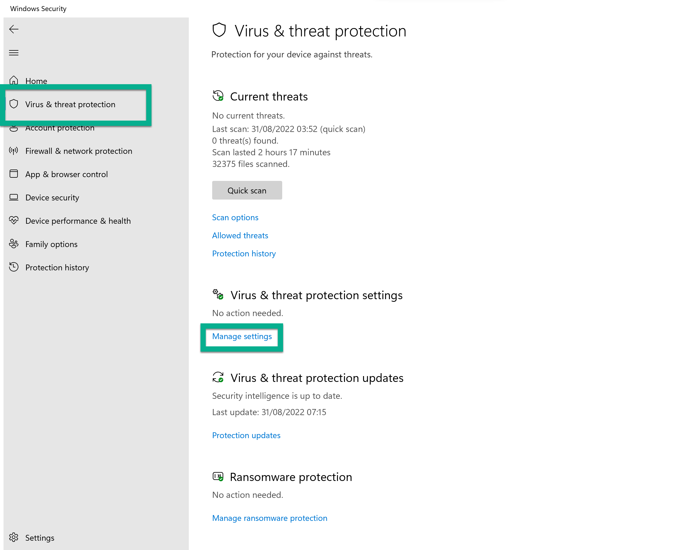
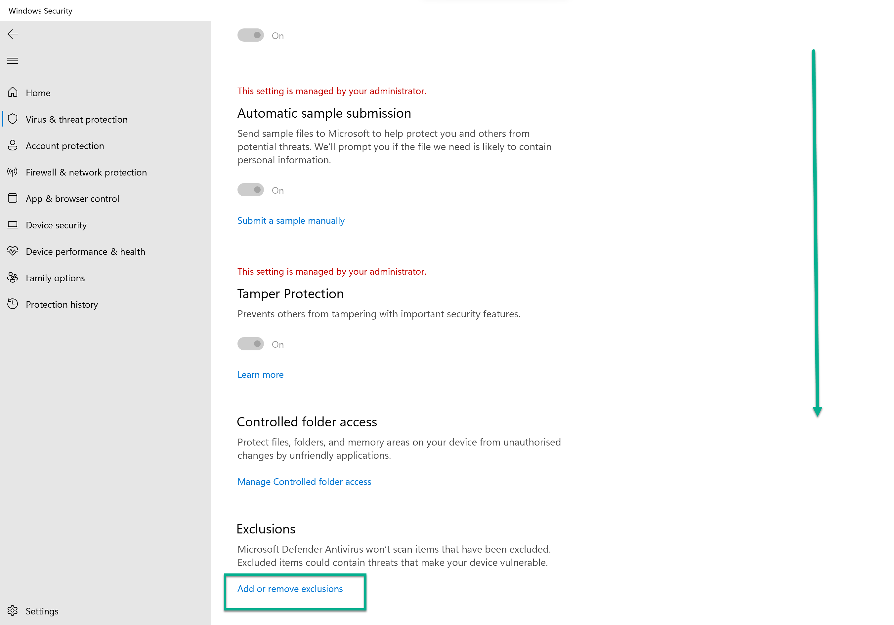
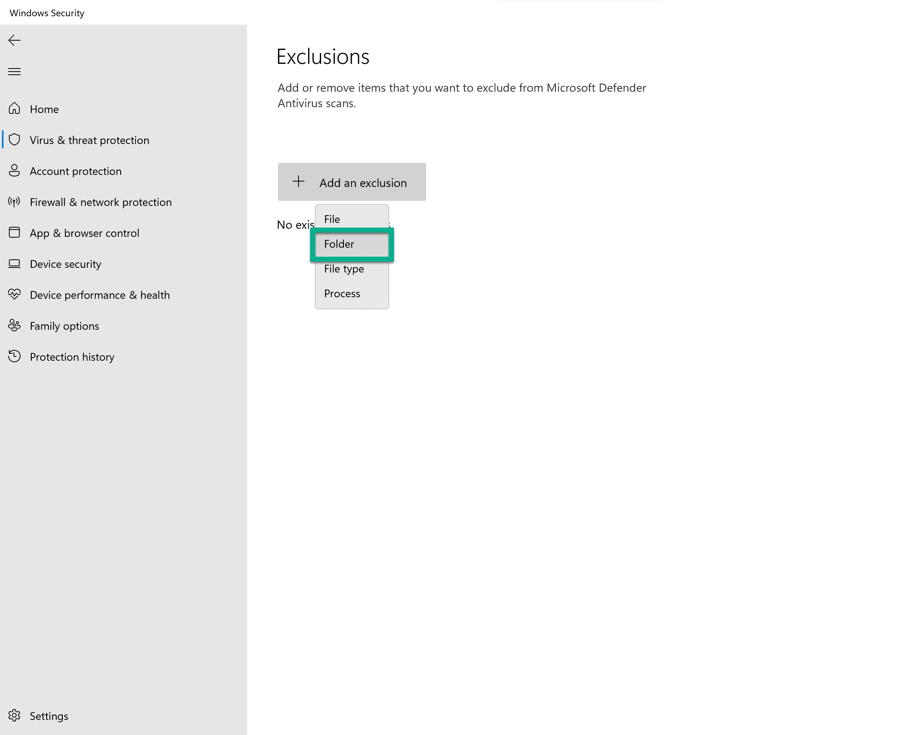
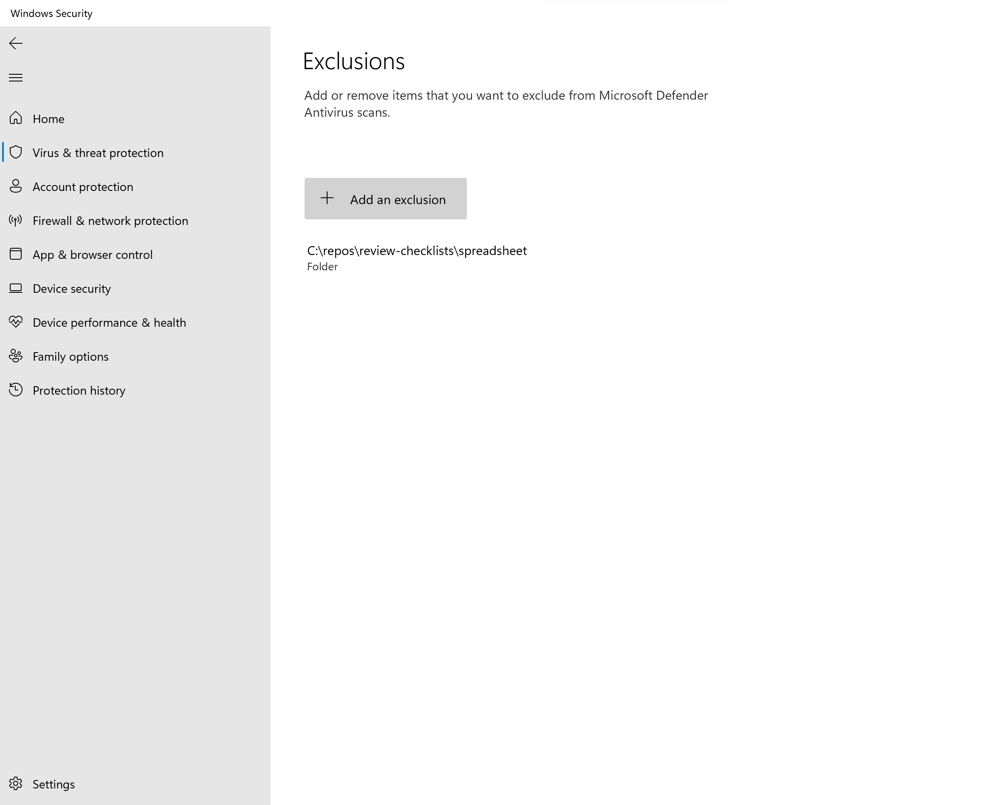

# Azure Review Checklists

Quick links for using the checklists in this repo:

- [Latest release of the Excel spreadsheet](https://github.com/Azure/review-checklists/releases/latest/download/review_checklist.xlsm)
- [https://aka.ms/ftaaas](https://aka.ms/ftaaas) for a web frontend (check out our sister repo [https://github.com/Azure/fta-aas](https://github.com/Azure/fta-aas)).

Summary of checklists supported and the respective responsible owners:

| Checklist | Status | CodeOwners |
| --- | --- | --- |
| ALZ  | GA | FTA-ALZ-vTeam, ALZ-checklist-contributors  |
| WAF | GA | Dynamically generated |
| AKS | GA | [@msftnadavbh](https://github.com/msftnadavbh) [@seenu433](https://github.com/seenu433) [@erjosito](https://github.com/erjosito) |
| ARO | Preview | [@msftnadavbh](https://github.com/msftnadavbh) [@naioja](https://github.com/naioja) [@erjosito](https://github.com/erjosito) |
| AVD | GA | [@igorpag](https://github.com/igorpag) [@mikewarr](https://github.com/mikewarr) [@bagwyth](https://github.com/bagwyth) |
| Cost | GA | [@brmoreir](https://github.com/brmoreir) [@pea-ms](https://github.com/pea-ms) |
| Multitenancy | GA | [@arsenvlad](https://github.com/arsenvlad) [@cherchyk](https://github.com/cherchyk) |
| Application Delivery Networking | GA | [@erjosito](https://github.com/erjosito) [@andredewes](https://github.com/andredewes) |
| AVS design | Preview | [@fskelly](https://github.com/fskelly) [@mgodfrey50](https://github.com/mgodfrey50) [@robinher](https://github.com/robinher) |
| AVS implementation | Preview | [@fskelly](https://github.com/fskelly) [@mgodfrey50](https://github.com/mgodfrey50) [@robinher](https://github.com/robinher) |
| SAP | GA | [@NaokiIgarashi](https://github.com/NaokiIgarashi) [@AlastairMorrison](https://github.com/AlastairMorrison) [@mottach](https://github.com/mottach) |
| API Management | Preview | [@andredewes](https://github.com/andredewes) [@seenu433](https://github.com/seenu433) |
| Stack HCI | Preview | [@mbrat2005](https://github.com/mbrat2005) [@steveswalwell](https://github.com/steveswalwell) [@igomaa](https://github.com/igomaa) |
| Spring Apps | Preview | [@bappadityams](https://github.com/) [@vermegi](https://github.com/vermegi) [@fmustaf](https://github.com/fmustaf) |
| Azure DevOps | Preview | [@roshair](https://github.com/roshair) |
| SQL Migration | Preview | [@karthikyella](https://github.com/karthikyella) [@dbabulldog-repo](https://github.com/dbabulldog-repo) |
| Security | Deprecated | [@mgodfrey50](https://github.com/mgodfrey50) [@rudneir2](https://github.com/rudneir2) |

## What is an Azure Design Review?

A common request of many organisations, starting with the public cloud, is to have their design double-checked to make sure that best practices are being followed. The scope of this exercise could vary, from generic Azure landing zones to workload-specific deployments.

When doing Azure design reviews (or any review for that matter), Microsoft employees and Microsoft partners often leverage Excel spreadsheets as the medium of choice to document findings and track design improvements and recommendations. A problem with Excel spreadsheets is that they are not easily subject to revision control. Additionally, team collaboration with branching, issues, pull requests, reviews, and others is difficult at best—impossible in most cases.

## Why this repository?

This repo separates the actual review checklist content from the presentation layer so that the JSON-formatted checklist can be subject to version control, and it can then be imported into an Excel spreadsheet by means of Visual Basic for Applications (VBA) macros for easier handling (not all of us like working natively with JSON). The provided [Checklist Review Spreadsheet](https://github.com/Azure/review-checklists/releases/latest/download/review_checklist.xlsm) leverages code to interpret JSON from the VBA module in [https://github.com/VBA-tools/VBA-JSON/](https://github.com/VBA-tools/VBA-JSON/), from which there is a copy in this repo to be self-contained (make sure you use the latest version though). The [Checklist Review Spreadsheet](https://github.com/Azure/review-checklists/releases/latest/download/review_checklist.xlsm) includes some macros (find the source code both in the spreadsheet as well as [here](./spreadsheet/Sheet1.cls)), which are accessible from control buttons in the main sheet.

Note: the VBA code in the spreadsheet does not work on Excel for Mac, due to some critical missing libraries.

Additionally, a Github action in this repository translates after every commit the English version of the checklist to additional languages (Japanese, Korean, Spanish, and Brazilian Portuguese), using the cognitive service [Azure Translator](https://azure.microsoft.com/services/cognitive-services/translator/). See an example of a translated checklist in [aks_checklist.ja.json](./checklists/aks_checklist.ja.json)

## Reporting errors and contributing

Please feel free to open an issue or create a PR if you find any error or missing information in the checklists, following the [Contributing guidelines](./CONTRIBUTING.md)

## Using the spreadsheet for Azure reviews

1. Download the Excel spreadsheet from the [latest release](https://github.com/Azure/review-checklists/releases/latest/download/review_checklist.xlsm) to your PC

2. Use the dropdown lists to select the technology and language you would like to do your review

3. Click the control button "Import latest checklist". After you accept the verification message, the spreadsheet will load the latest version of the selected technology and language

4. (Optional) If you are going to distribute the spreadsheet to users who cannot work with macros (for example, either because of security reasons or because they use Office for Mac), save a version of the spreadsheet in xlsx format (instead of xlsm). Note that disabling macros will result in the spreadsheet losing its ability to import updated versions of the checklist or JSON-based Azure Resource Graph query results

5. Go row by row, set the "Status" field to one of the available options, and write any remarks in the "Comments" field (such as why a recommendation is not relevant, or who will fix the open item)

   1. Since there are many rows in a review, it is recommended to proceed in chunks: either going area after area (first "Networking", then "Security", etc) or starting with the "High" priority elements and afterward moving down to "Medium" and "Low"
   1. If any recommendation is not clear, there is a "More Info" link with more context information.
   1. **IMPORTANT**: design decisions are not a checkbox exercise, but a series of compromises. It is OK to deviate from certain recommendations if the implications are clear (for example, sacrificing security with operational simplicity or lower cost for non-critical applications)

6. Check the "Dashboard" worksheet for a graphical representation of the review progress

## Security settings running macros

There are some settings that you might need to change in your system to run macro-enabled Excel spreadsheets. When initially opening the file you may see the following error, which prevents Excel from loading:

> Excel cannot open the file 'review_checklist.xlsm' because the file format or file extension is not valid. Verify that the file has not been corrupted and that the file extension matches the format of the file.

In other cases, the file opens with the following message, which prevents you from being able to load the checklist items:

### Unblock the file or add an exception to Windows Security

1. You might need to unblock the file from the file properties in the Windows File Explorer so that you can use the macros required to import the checklist content from github.com:

2. Additionally, you might want to add the macro-enabled spreadsheet file to the list of exceptions in Windows Security (in the Virus & Threat Protection section):

## Using the spreadsheet to generate JSON checklist files (advanced)

If you wish to do contributions to the checklists, one option is the following:

1. Load up the latest version of the checklist you want to modify
2. Do the required modifications to the checklist items
3. Push the button "Export checklist to JSON" in the **"Advanced"** section of controls in the checklist. Store your file in your local file system, and upload it to the [checklists folder](./checklists) of this Github repo (use the format `<technology>_checklist.en.json`, for example, `lz_checklist.en.json`)
4. This will create a PR and will be reviewed by the corresponding approvers.

## Using Azure Resource Graph to verify Azure environments (advanced)

Some of the checks have associated [Azure Resource Graph](https://learn.microsoft.com/azure/governance/resource-graph/overview) queries, which return a list of related resources and a compliance status for each. Resource Graph queries enable objective verification of the associated checks and make filling out the spreadsheet easier by collecting some environment details for you. 

Along with the spreadsheet, this repo includes the script [checklist_graph.sh](./scripts/checklist_graph.sh). This script will run the graph queries stored in the JSON checklists and produce an output that can easily be copied and pasted into the spreadsheet, or alternatively generate a JSON file that can then be imported to the spreadsheet.

See the [checklist_graph.sh README file](./scripts/README.md) for more information about how to use [checklist_graph.sh](./scripts/checklist_graph.sh).

## Disclaimer

- This is not official Microsoft documentation or software.
- This is not an endorsement or a sign-off of an architecture or a design.
- This code sample is provided "AS IT IS" without warranty of any kind, either expressed or implied, including but not limited to the implied warranties of merchantability and/or fitness for a particular purpose.
- This sample is not supported under any Microsoft standard support program or service.
- Microsoft further disclaims all implied warranties, including, without limitation, any implied warranties of merchantability or fitness for a particular purpose.
- The entire risk arising out of the use or performance of the sample and documentation remains with you.
- In no event shall Microsoft, its authors, or anyone else involved in the creation, production, or delivery of the script be liable for any damages whatsoever (including, without limitation, damages for loss of business profits, business interruption, loss of business information, or other pecuniary loss) arising out of the use of or inability to use the sample or documentation, even if Microsoft has been advised of the possibility of such damages
