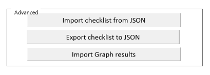
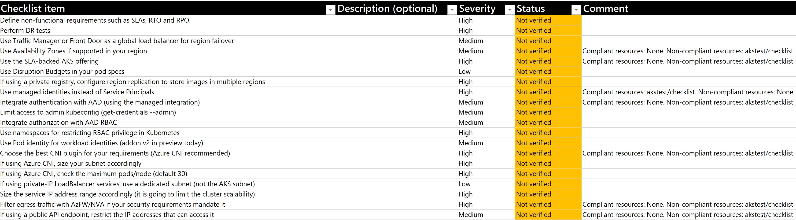

# Review Checklist Scripts (preview)

In this folder you can find scripts supporting the review process.

## Azure Resource Graph reviews

The script [checklist_graph.sh](./checklist_graph.sh) can do the automated graph queries associated to checklist items in the checklists in the [../checklists](../checklists) folder. It has multiple modes of operations, the following sections show some examples of how to use it.

### Installation

> :warning: ***The `checklist_graph.sh` script must be run from a Bash environment shell. If you are using Azure Cloud Shell be sure to select the correct environment.***

> Note: In case you are in the context of a private AKS cluster (API server is private), there is no restriction to use Azure Cloud Shell to run the `checklist_graph.sh` script. 
> Make sure that the identity (the one Azure Cloud Shell uses) used to execute the checklist_graph script, [has appropriate rights in Azure RBAC with at least read access to the resources you want to query](https://learn.microsoft.com/azure/governance/resource-graph/overview#permissions-in-azure-resource-graph) (in this case AKS cluster(s)). 
> Without at least read permissions to the Azure object or object group, results won't be returned.
> The script just queries the Azure Resource Graph API and does not communicate with the API Server(s) of your clusters(s).
	
You can download the script in any environment that supports Azure CLI, such as the [Azure Cloud Shell](https://shell.azure.com). In order to download the script and prepare it for execution you can run this command:

```Shell
wget –quiet –output-document ./checklist_graph.sh https://raw.githubusercontent.com/Azure/review-checklists/main/scripts/checklist_graph.sh
chmod +xr ./checklist_graph.sh
```

### Basic usage

You can run the script to produce a JSON-formatted output of all the checklist items with documented Azure Resource Graph queries. For example, to run the Azure Resource Graph queries for the AKS checklist:

```Shell
./checklist_graph.sh --technology=aks --format=json > ./graph_results.json
```

The previous command will generate a JSON file `./graph_results.json`. You can go now to your Excel spreadsheet. Make sure you have loaded up the corresponding checklist already (AKS in this example), and use the Advanced command "Import Graph Results" to import this file into the spreadsheet:



The "Comments" column of the spreadsheet will fill in with the results of the Azure Graph Queries, and display resource IDs that are compliant or non-compliant with the recommendation, as the following picture shows (in this case, after importing the results of the Azure Resource Graph checks on a subscription with a single AKS cluster):



The following sections will show more advanced usage of the script.

### Listing the available checklists available

You can run the script to find out which checklists are available. Note that not all checklists will contain Azure Resource Graph queries:

```
./checklist_graph.sh --list-technologies
```

### Listing the existing categories in a checklist

You can run the script as well to generate a more human-readable output. For example, run this in order to execute analysis scoped to a single category. Command:

```
./checklist_graph.sh --techonology=aks --list-categories
```

Output:

```
0: - Identity and Access Management
1: - Network Topology and Connectivity
2: - BC and DR
3: - Governance and Security
4: - Cost Governance
5: - Operations
6: - Application Deployment
```

### Doing a review for all categories with console output

This example shows how to run this for analysis on all categories in a single subscription. The output can be copy/pasted to the Excel spreadsheet (category by category). Command:

```
./checklist_graph.sh --technology=aks --format=text
```

Output (truncated for brevity). Note that the resources are formatted with the syntax `<resource-group>/<resource-name>`:

```
CHECKLIST ITEM: Use Availability Zones if supported in your Azure region:
/subscriptions/e7da9914-9b05-4891-893c-546cb7b0422e/resourceGroups/akstest/providers/Microsoft.ContainerService/managedClusters/checklist: non-compliant
CHECKLIST ITEM: Use the SLA-backed AKS offering:
/subscriptions/e7da9914-9b05-4891-893c-546cb7b0422e/resourceGroups/akstest/providers/Microsoft.ContainerService/managedClusters/checklist: non-compliant
CHECKLIST ITEM: Use managed identities instead of Service Principals:
/subscriptions/e7da9914-9b05-4891-893c-546cb7b0422e/resourceGroups/akstest/providers/Microsoft.ContainerService/managedClusters/checklist: compliant
...
```

### Run the graph queries scoped to a Management Group

All previous commands can be scoped to a management group, instead of to a single subscription by using the `--management-group` flag, to specify a management group name (make sure to specify the **name** and not the **display name** of the management group). Example:

```
./checklist_graph.sh --technology=aks --category=1 --management-group=mymgmtgroup
```

The output is the same as the previous examples, depending on which flags are used.

### Troubleshoot

To troubleshoot the execution of the `checklist_graph.sh` script you can run the command:

```
./checklist_graph.sh --technology=aks --format=json --debug
```

and check the debug messages being written in the Azure Cloud Shell console
