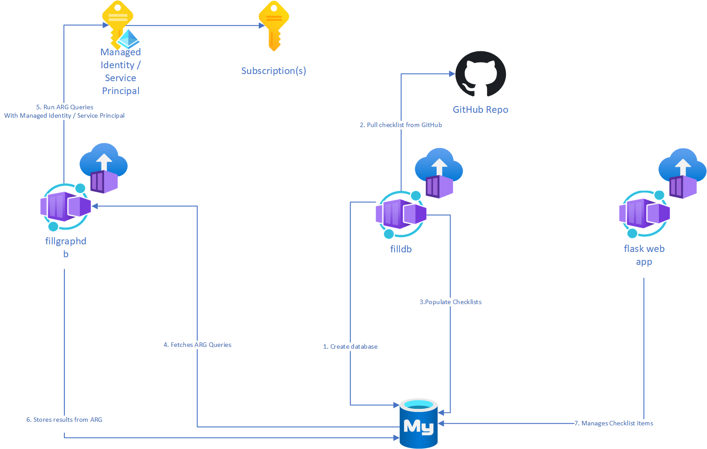
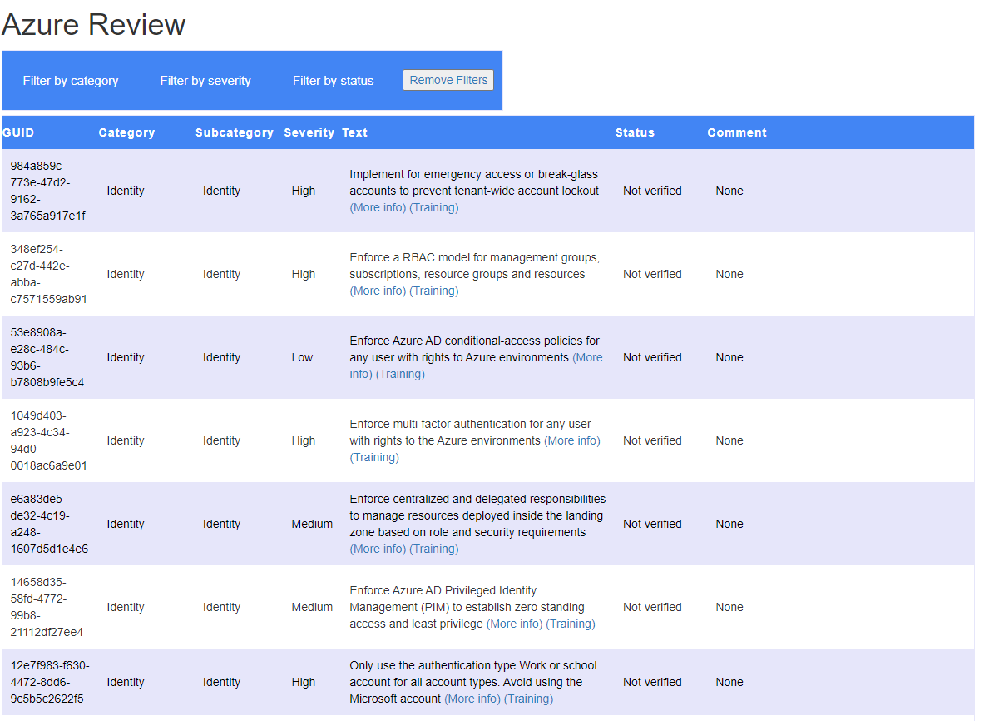

# Prototype for web-based checklist

This is a Minimum Viable Product (MVP) for an architecture for web-based checklist reviews. It consists of the following elements:

**High Level Overview**  

- A MySQL database
- An Azure Container Instance that will launch 3 containers:
    - `filldb` (init container): creates the required database and tables in the MySQL server, and fills in the data imported from the latest checklist
    - `fillgraphdb` (init container): executes any Azure Resource Graph queries stored in the checklist, and stores the results in the MySQL database
    - `flask` (main container): a flask-based web frontend that allows inspecting the MysQL checklist table, as well as updating the status and comments of each individual checklist item

This screenshot shows the `flask` container web interface that can be used to frontend the MySQL database containing the review checklist items:

The `fillgraphdb` container needs to authenticate to Azure to send the Azure Resource Graph queries. There are two options:

- **Working today**: With Service Principal credentials
- **Roadmap**: With a [User-Managed Identity](https://learn.microsoft.com/azure/active-directory/managed-identities-azure-resources/overview#how-can-i-use-managed-identities-for-azure-resources) with read access to the subscription(s). The `identityId` parameter of the ARM template needs to be provided. Initial tests have shown that the User-Managed Identity is not available in the init containers.

The [Azure CLI deployment script for Service Principals](./arm/deploy_sp.azcli) shows how to create the Service Principal, assign the reader role for the whole subscription, and launch the ARM template to create the MySQL server and the Azure Container Instance (it doesn't store the Service Principal secret in an Azure Key Vault, that would be highly advisable). If you already have the Service Principal, you can deploy the ARM template graphically as well using the button below:

The web interface will be available in the public IP address of the ACI container group, on TCP port 5000.

## Future improvements

Since this is only a prototype, there are some aspects not being addressed for the sake of simplicity:

- Figure out why the user-managed identities seem not be reachable from the init containers
- No HTTPS (it could be easily achieved with an nginx sidecar in the ACI container group)
- No authentication (an authentication proxy such as Ambassador could be leveraged for this)
- The network firewall of the MySQL server is fully open (it could be closed down to the ACI egress IP address)
- The UI of the flask container is rather rudimentary, but it shows the basic principles and does live updates to the MySQL database without having to press any "Submit" button
- SSL Enforcement is disabled in the MySQL Server due to `flask-mysql` not using encryption
- Decouple the containers, so that they can be launched independently:
    - It should be possible to launch the `fillgraphdb` container at any time, to refresh the Graph results
    - It should be possible to restart the `flask` container (web) without having the `filldb` container run as an init container wiping out the database

Contributions highly appreciated!
