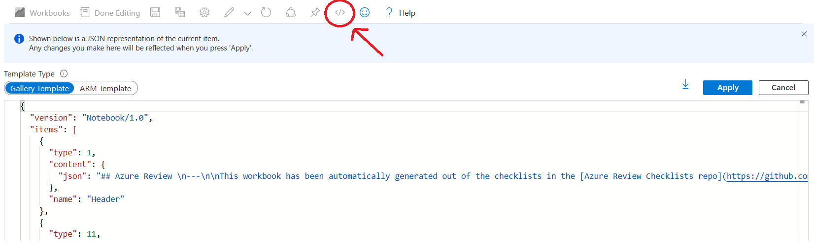
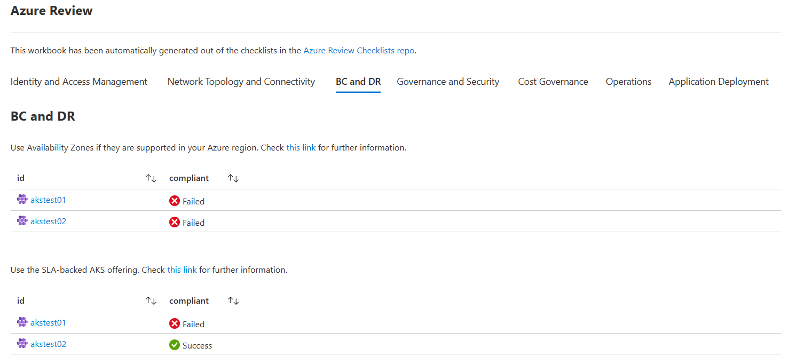

# Automatic workbook creation

The checklists in this repo have the option of documenting Azure Resource Graph queries along with each check, to dynamically verify whether the resources in your subsciption(s) are compliant with the checklist recommendations.

To quickly check these out you can import them via ARM into your Azure Monitor instances:

- Landing Zone review workbook:

- Networking - Landing Zone review workbook:

- AKS review workbook:

The Github pipelines in this repo automatically generate Azure Monitor workbooks with those queries grouped in their corresponding categories, for easy consumption. In order to deploy these workbooks to your Azure Monitor instance, you can do a simple copy/paste operation from the corresponding JSON file (for example [alz_checklist.en_workbook.json](alz_checklist.en_workbook.json) or [aks_checklist.en_workbook.json](aks_checklist.en_workbook.json)), and copy them into the advanced editor mode of an Azure Monitor workbook. For example:

After doing this the queries will start running and you will see a list of the resources in your subscription that comply and not comply with each specific recommendation with documented Azure Resource Graph queries. For example, the following screenshot shows the BC/DR section of the AKS workbook:

Please do not send contributions to these workbooks, since they are generated dynamically out of the building blocks contained in the [blocks directory](./blocks/) and the Azure Resource Graph queries defined in the files contained in the [checklists directory](../checklists/).

